# System-Design-and-Backend-Engineering-with-AWS---Poridhi

## Helping resource
1. https://excalidraw.com/

## Course Information
- Course Link: https://poridhi.io/course-details/7f406007-fb7a

## System Design Resources
- Grokking the System Design Book

## Problem Solving Resources
- Neetcode Roadmap: https://neetcode.io/roadmap
- Take U Forward: https://www.youtube.com/@takeUforward
- Take U Forward Website: https://takeuforward.org/strivers-a2z-dsa-course/strivers-a2z-dsa-course-sheet-2/
- Blind 75 Leetcode Questions: https://leetcode.com/discuss/general-discussion/460599/blind-75-leetcode-questions

## System Design & Backend Development Course Overview
- System Design & Development End-to-end process: System Build -> System Deploy (AWS) -> System Monitoring
- Course Overview: Basic -> Math -> NodeJS API Development -> Rate Limit Module -> Load Balancer -> Docker -> Microservices -> Kubernetes -> Redis, RabbitMQ

## All modules google drive link
1. All modules: https://drive.google.com/drive/folders/1e7fyBRqZvwZMPBiX7ykhw2NF74Jaym2R

## MODULE ONE: SYSTEM DESIGN BASICS
### Class ONE


## Networking resources
1. Practical Networking:https://www.practicalnetworking.net/index/networking-fundamentals-how-data-moves-through-the-internet/
2. Networking and Kubernetes: A Layered Approach Book: https://dokumen.pub/networking-and-kubernetes-a-layered-approach-1nbsped-1492081655-9781492081654.html

### Class TWO


### Class THREE


### Class FOUR


## MODULE TWO: MATHEMATICS FOR SYSTEM DESIGN


## MODULE THREE: NODEJS API DEVELOPMENT
### Section: NODEJS
#### What is NodeJS


### Section: NODEJS ESSENTIALS
#### How to do it in Backend


#### How to do it in Backend - Get Request in Details


#### How to do it in Backend- Post API Request


#### DATA FLOW


#### Installing Postgres Pgadmin
1. Download and install PostgreSQL: https://www.postgresql.org/download/
2. Download and install PgAdmin4: https://www.pgadmin.org/download/

#### Make a GET request and understand the flow
1. Create a Database named "student"
2. Create a table named "person" with id, name, age, result fields
```
CREATE TABLE person (
    id SERIAL PRIMARY KEY,
    name VARCHAR(100),
    age INTEGER,
    result VARCHAR(50)
);
```
3. Insert Data into person table
```
INSERT INTO person (name, age, result) VALUES 
    ('John', 25, 'Pass'),
    ('Alice', 30, 'Fail'), 
    ('Bob', 28, 'Pass');
```
4. Process flow


#### Routing in Node JS Application
1. Layered Architecture of Node JS

2. Layered Architecture Flow


#### What is ORM?
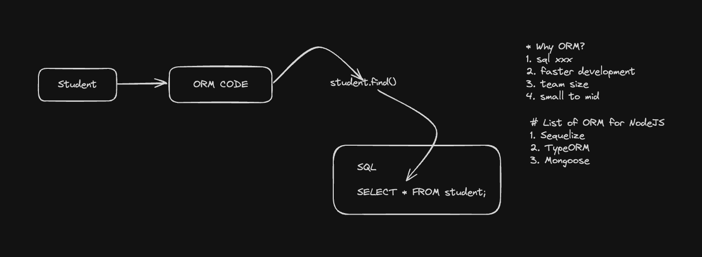

#### Designing Enterprise Nodejs Systems
1. Best Practices for enterprise nodejs systems
* Typescript
* ORM
* ExpressJS

2. Install typescript globally
```
$ npm install -g typescript
// Check typescript version
$ tsc -v
```
3. Install ts-node globally
```
$ npm install -g ts-node
// Check ts-node installed version 
$ ts-node -v
```
4. Install typeorm globally
```
$ npm i -g typeorm
```
5. Initialize a new project with typeorm CLI including PostgreSQL as Database inside project directory
```
$ typeorm init
```
6. Start project
```
$ npm start
```
7. How model/entity works as DB query
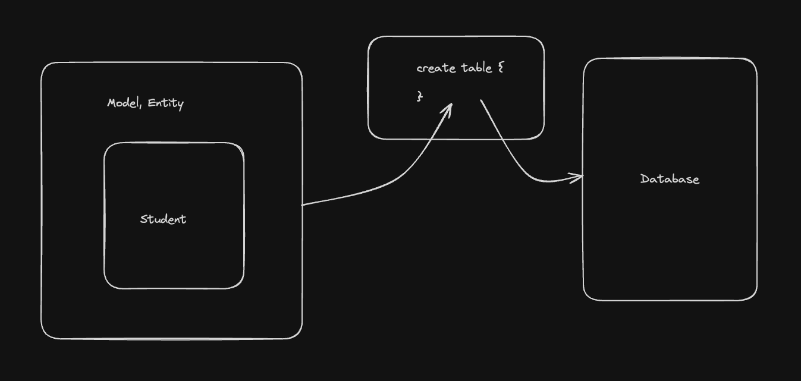

8. How AppDataSource of TypeORM connect with DB
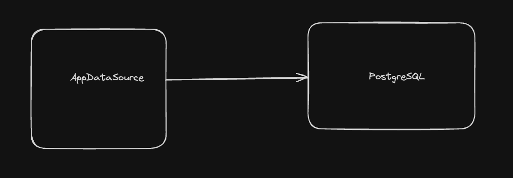

9. How AppDataSource build live connection and make queries from DB
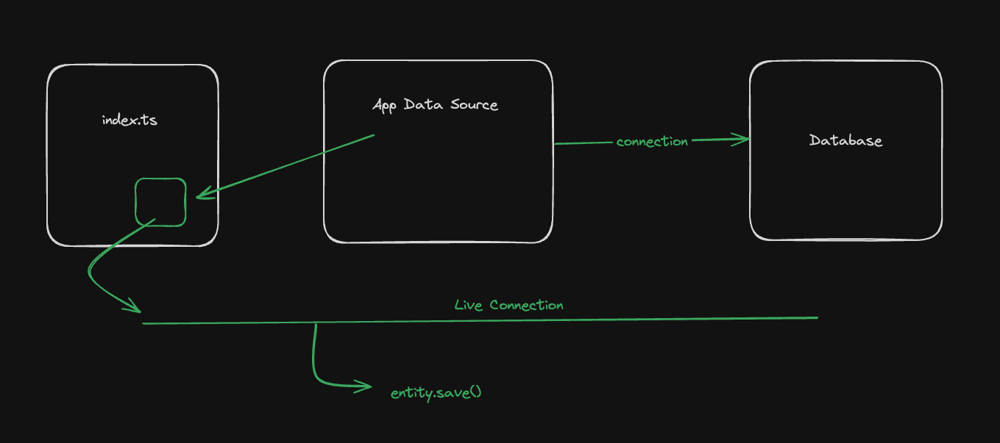

10. Dataflow from DB to Client App via node app using ORM
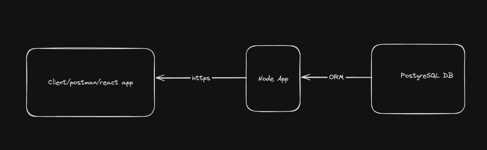

11. Install Express & Express Types with TypeORM for TypeScript
```
$ npm i express
$ npm i --save-dev @types/express
```

12. Add esModuleInterop true inside the tsconfig.json file to enable es module import
```
"esModuleInterop": true
```

#### Microservice Approach For Backend Services
1. Designing Data-Intensive Applications Book - https://www.amazon.com/Designing-Data-Intensive-Applications-Reliable-Maintainable/dp/1449373321
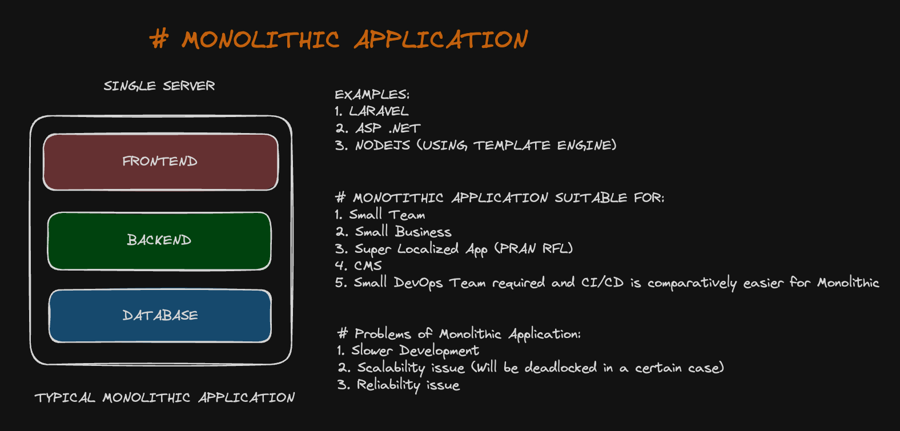
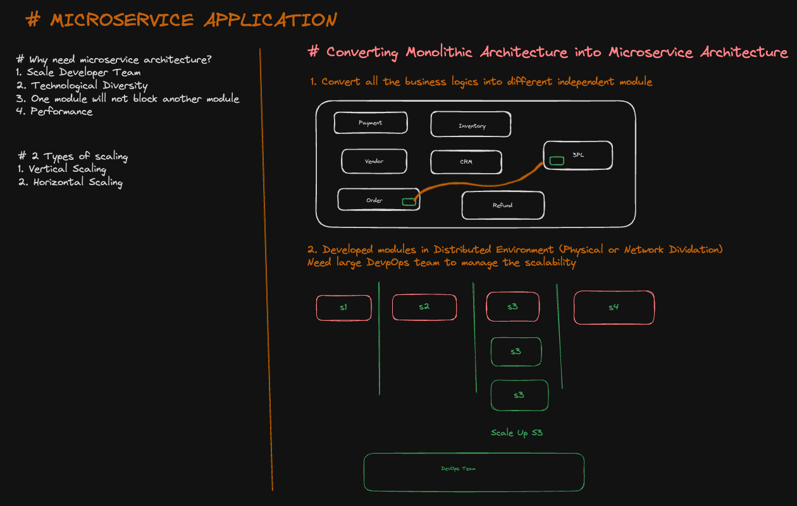
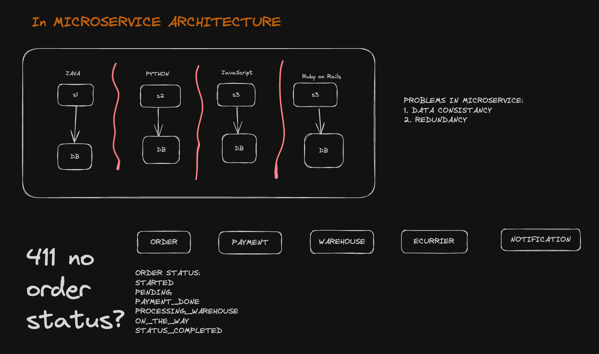
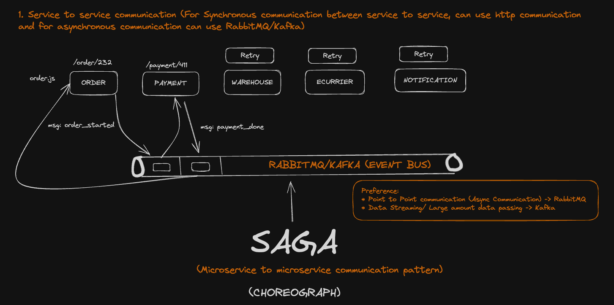
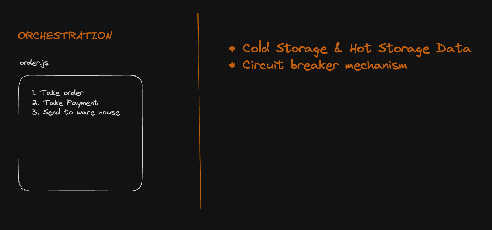
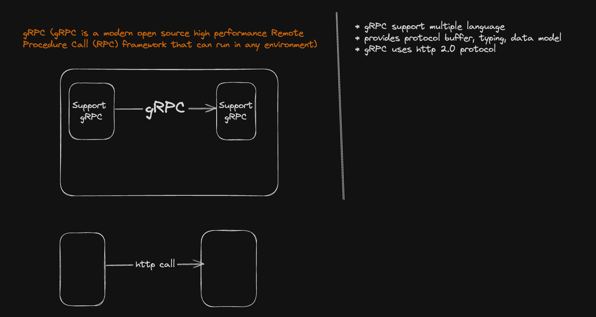
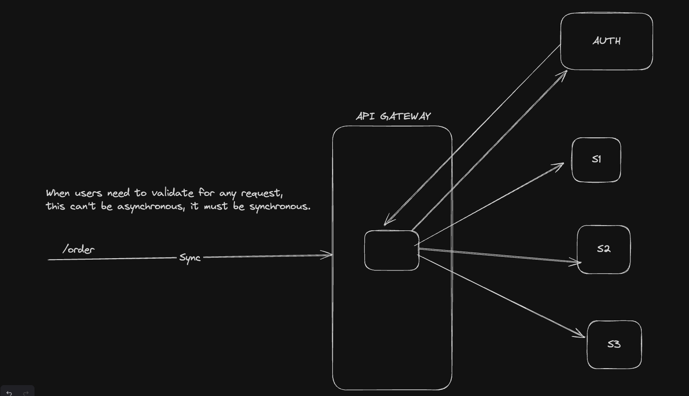
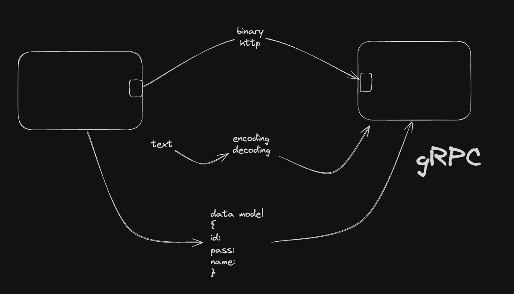
